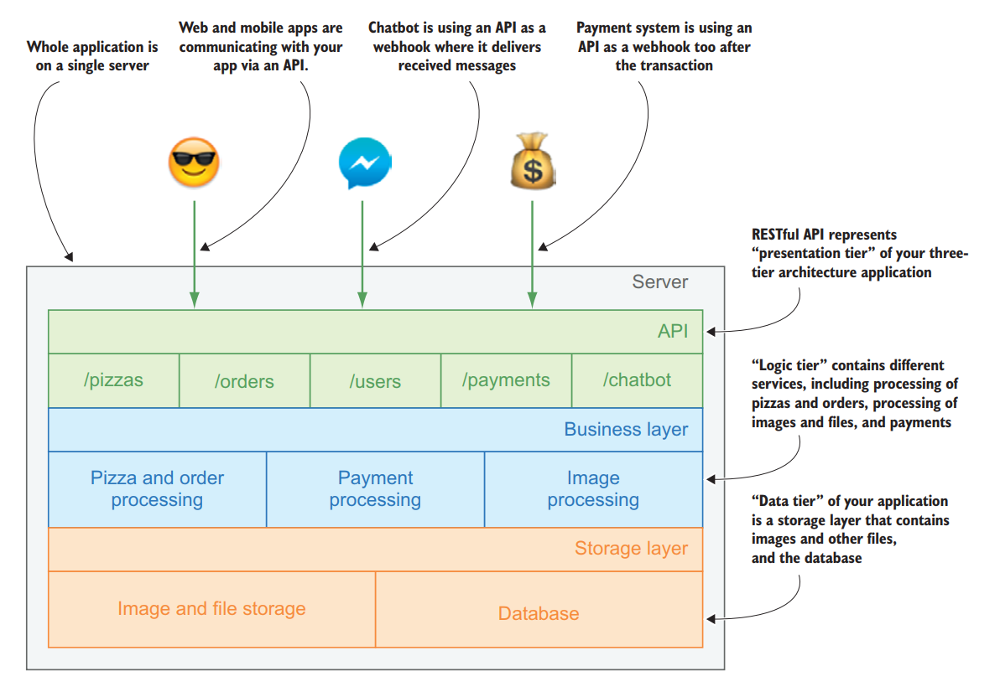
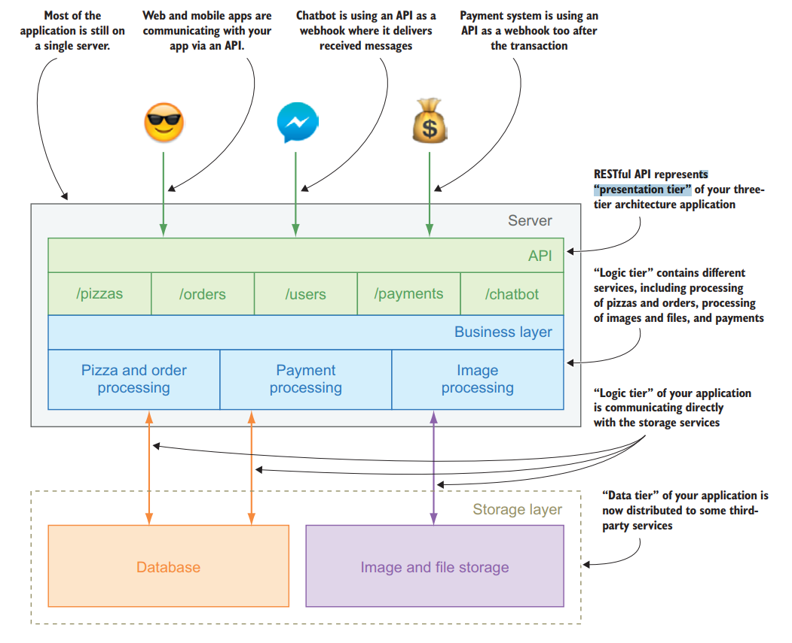

# 第一章 Claudia无服务器概述

[TOC]

本章包括

- 无服务器是啥？
- 无服务器的核心概念
- 无服务器和主机web应用的差别
- Claudia是如何干活的
- 为啥要用无服务器

无服务器是在云平台上部署和运行应用的一种方法，只对每个用户收取费用，而不是说去租或者买服务器。无服务器平台供应商会负责容量计划，伸缩，均衡和监控，这些事情统统不用你管，而且供应商还会将你的应用作为函数(functions)来干活。

等一下，没服务器？看起来又像一个新的流行词，新潮的云趋势会给你的生活带来更好的变革。

这本书解释啥叫无服务器，它能解决什么问题，在你的应用开发流程中哪里适合无服务器，哪里不适合无服务器，本书不会像其他时髦的云崇拜一样炫耀或者兜售无服务器，需要每个人都跟进来。本书利用了实用主义的方式，通过教你如何用Node.js和Claudia.js搭建可靠的可伸缩的服务来解释这些概念，这样做的同时可以节省时间和资源。

本章集中在无服务器的概念：无服务是啥玩意儿，为啥这东西重要，它跟主机服务器web应用开发对比又怎样。你在本章的主要目的就是对基本的无服务器概念有很好的理解，并建立一个好的基础。

## 1.1 服务器和洗衣机

为了能够理解无服务器，那么闲考虑一下洗衣机。用洗衣服的应用开头听起来还是挺有意思的，但是这年头拥有一台服务器跟拥有一台洗衣机意思差不多。每个人都得洗衣服，那么大部分的逻辑就是去买一台洗衣机回家。但是大部分时间这个洗衣机也是闲置在那里，啥活也不干。最多了一个礼拜也有用它5到15个小时。服务器也差不多是这样子。大部分时间，你的应用服务器也就是躺在那里等着接收请求，啥也不干。

有点意思了，服务器和洗衣机还是有很多的共同点的。他们都有最大可处理的重量和体积。有一个小服务器就跟有一台小洗衣机差不多；如果你积攒了一大堆衣服，那么洗衣机肯定是一次性洗不完的。你可以买一个大点的洗衣机可以一次性洗20磅的衣服，但是你得考虑当你只有一件衬衫要洗的时候的情形，让一台能洗20磅的衣服的洗衣机洗一件衬衫，很显然是大材小用了。而且，把你所有的应用都放在一台服务器上跑也是挺棘手的，而且有时候也不可能让那么多应用都在一台服务器上跑。你正确地搭建了一个app，但是这个app却被另外一个app的设置全部打乱了。洗衣机也是这样的，你必须把你的衣服按照颜色分开，然后选择合适的程序，清洁剂和软化剂一起配合。如果你没有恰当地准备，那么洗衣机就会毁掉你的衣服。

除了上述问题，那么顺带的一个问题就是：不是每个人都有自己的洗衣机，那好，那就搞个自助洗衣店——塞硬币的洗衣机，你可以租用时间来洗自己的衣服。对于服务器，许多公司都有同样的需求，那就是提供服务器租赁服务，要么在本地，要么在云端。你可以组一个服务器，服务器供应商帮你照看存储，电源，和一些基本的设置。自助洗衣房和服务器租赁都仅仅解决一部分问题。

对洗衣机和服务器的租用，你依然需要知道如何分配你的衣服和应用，如何设置机器。选择合适的清洁剂和环境。而且你还必须平衡机器的数量，它们的限制，计划你需要多少。

在一个堆满脏衣服的世界里，在20世纪下半叶，“fluff and fold”服务出现了。你可以带一件衣服，也可以带一包衣服，然后它们将会帮你清洁，烘干，并且折叠好你的衣服。有些甚至可以将你的衣服寄回家。它们一般来说是按照衣服的件数收费，所以你没必要等到积攒到一大堆衣服的时候一起拿去去洗，而且你也不需要担心洗衣机，清洁剂，以及清洁程序等等所有一切事务。

跟服装清洁工业相比，软件工业依然处在自服务的自助洗衣房年代，因为许多人还是在租服务器或者用平台即服务(PaaS)供应商。我们依然在评估潜在的请求数量（衣服数量），然后要处理或者安排足够的服务器来处理负载，总是浪费很多时间在服务器上，要么就是没有全力以赴，要么就是超载，以致不能处理用户的所有请求。

## 1.2 核心概念
无服务是如何改变现有的状态的？看名字的话，没有服务器，貌似不是个办法。回到定义：

> 什么是无服务器
> 无服务器是在云设施上面部署，运行应用的一种方法，只对每个用户收取费用，而不是说去租或者买服务器。

与其名字相反，无服务器不是说让服务器消失。软件要跑起来是需要硬件的。无服务器仅仅是去掉了公司，组织或者开发人员去实际地租用或者买一台服务器。

你可能疑问为啥要叫个无服务器。答案是服务器概念的无服务器的抽象。不用为你的应用租用服务器，搭建环境，部署代码，你只需要上传你的应用到你的无服务器供应商，这将关乎服务器分配，存储，应用管理，搭建，执行。

> Note 有人可能会问，无服务器是不是会砍掉公司对大的DevOps team的需求，对于大部分情况来讲，是的。

更加准确地讲，供应商是把你的应用保存在了一个容器里。这个容器是一个隔离的环境，它囊括了你应用要跑起来所需要的所有的东西。你可以认为这个容器是一个花盆，这个盆里面有土壤，以及你植物生存所需要的一切矿物质。

跟花盆一样，容器允许无服务器供应商安全地移动和保存你的应用，执行和复制那就完全由你的需求决定。但是无服务器最主要的一处就是你不需要对服务器做任何配置，均衡和伸缩——一般基本的服务器管理。无服务器供应商会管理所有的事务的同时，还能保住同一时刻有大量对服务的调用的发生，他会克隆足够的容器来处理这些调用，而且每一个克隆都是第一个容器原封不动的拷贝。如果有必要的话，供应商会复制几千个克隆。无服务器供应商只有在你的应用请求数量变得非常大一直当前的容器不能处理再进来的请求的时候，它会复制容器。

如果你的应用上没有请求，而且你的应用不止一个实例在允许，那么它也不会浪费空间，服务器时间和电源。无服务器供应商会负责所有的运营细节，例如你的应用在哪里保存的，如何复制，要复制到哪里，啥时候加载新容器，何时减少复制容器的数量来卸载没有用的服务器。

从洗衣机的角度看，这个过程就像调用一个抖松和折叠（fluff and fold）的清洁服务，快递员上门取到你的脏衣服，然后把洗衣房返回给你。无论你有多少衣服，无论你有多少种衣服，衣服清洁公司负责所有的过程：分类，清洁剂选择，程序选择。

> 无服务器和函数即服务（FaaS）
> 最开始无服务器这个术语跟现在解释的还是不一样的。在无服务器早期，它被定义为后端即服务（BaaS），因为在基于服务的逻辑里，它部分或者全部依赖于第三方服务。后来呢，它就基本被解释为函数即服务（FaaS），因为无服务器供应商任务应用是函数，如果有需要直接调用它们就行了。

## 1.3 无服务器是如何工作的？

正如前面所描述的，无服务器供应商会为你的应用提供一个独立的计算容器。这个计算容器是事件驱动的，所以它只有在一定的事件被触发的时候才会被激活。

事件（*Events*）都是一些特定的外部动作，它的行为和物理触发器是一样的。举个栗子，你往家里带了一盏灯：对于打开这盏灯的事件可能是不相同的。一般来说就是用手指去按开关；运动探测器则是根据运动传；光传感器可以在太阳下山的时候打开打开你的灯。但是容器的话是不限于仅仅去监听某些特别的事件去调用你的容器函数；它还提供了可以自己创建事件的函数，或者更准确地说，是发出（emit）事件。如果从技术角度讲，无服务器就是你的函数容器既是事件监听器（*event listeners*）又是事件发射器（*event emitters*）。

最后，无服务器供应商提供各种触发器，这些触发器可以让你的应用跑起来。触发器的列表是取决于供应商和实现的，但是一些十分常见的触发器是HTTP请求，文件上传，文件存储，数据库更新，英特网事务（Internet of Thing）事件。还有其他很多的事件。

> Note  一个无服务器函数只有在被调用到的时候才会运行，你只需要为它的的执行时间付费即可。执行完毕后，服务器提供商就会关闭函数，同时还会让触发器保持在活动状态。

## 1.4 无服务器实战

整个无服务器的蓝图包括很多移动的部分，所以我们会慢慢地进行介绍。我们创建了一个应用示例，每次都带进来一点，这样你就可以看到它是如何工作的。随着你对每个新概念的深入理解，你讲会扩展到你的应用示例上。

这本书对它的示例应用程序采用了一种新的方法（它将从头开始构建），并且它更准确地处理小公司的问题，例如披萨店。比萨店是由虚构的玛利亚阿姨管理的。在阅读本书的过程中，玛丽亚阿姨将面临许多现实世界的问题，而你的目标就是帮助她，同时掌握无服务器的概念。像每一项新技术一样，无服务器技术引入了许多新概念，这些概念可能很难同时处理。

> Note 对于棕地环境（将当前应用程序迁移到无服务器环境），请跳到本书的最后一部分。如果您不熟悉无服务器，那么在跳到书的最后一部分之前，至少应该阅读一下前几章。

### 1.4.1 玛利亚阿姨的无服务器披萨店

玛丽亚姨妈是个意志坚强的人。三十多年来她一直在管理她的比萨店，那里有各种年龄的人，从邻居和家人在一起，一起大笑，甚至去浪漫的约会。但最近，她的比萨店有点困难。她告诉你她看到的顾客越来越少。她的许多客户现在更喜欢通过网站或手机在线订购，而不是亲自上门购买。一些新公司开始拉走她的顾客。例如，新国际象棋的皮兹里亚——一个带有披萨预览和在线订购的移动应用程序，还有一个聊天机器人通过各种通信应用程序进行订单。虽然阿姨的顾客喜欢她的比萨，但大多数还是想从家里订购，所以她三十年的生意开始衰落。Pizzeria已经有了一个网站，但它需要一个后端应用程序来处理和存储比萨饼和订单的相关信息。

### 1.4.2 一种常见的方法

鉴于Maria阿姨的资源有限，最简单的解决方案是使用流行的node.js框架（如express.js或Hapi）构建一个小型API，并在同一个实例中建立一个pizza数据库（很可能是MongoDB、MySQL或PostgreSQL）。

一个典型的API就是将其代码组织在类似于三层体系结构的几层中，这意味着代码被划分为表示层、业务层和数据层或其他层。

> 三层体系结构
>
> 三层体系结构是一种客户机/服务器软件体系结构模式，其中用户界面（表示）、功能流程逻辑（“业务规则”）和计算机数据存储和数据访问作为独立模块进行开发和维护，通常在单独的平台上。
> 如果想了解更多关于三层体系结构的信息，请访问 https://en.wikipedia.org/wiki/Multitier_architecture#Three-tier_architecture.

典型的三层应用程序设计将类似于图1.1，有单独比萨饼、订单和用户路由。它也有聊天机器人和支付处理器网络钩子的路由。所有路由都会在业务层触发一些处理程序函数，处理后的数据将发送到数据层——数据库以及文件和图像存储。

这种方法非常适合任何给定的小应用程序。这对你的比萨API非常有好处，这个好处至少会保持在网上比萨订单增长到一定水平之前。然后你会需要扩展基础架构。

但是为了能够扩展一个整体应用程序，就得分离数据层（因为为了数据一致性，你不想复制数据库）。之后，你的应用程序将类似于图1.2所示的应用程序。但你还是会拥有一个应用程序的联合体，它具有所有的API路由和业务逻辑。如果用户太多，可以复制应用程序，但每个用户实例也将复制其所有服务，不管它们的使用情况如何。



图 1.1 披萨API典型的三层设计



图 1.2 一种用于比萨饼API的外部数据库和文件存储的常见方法

### 1.4.3 无服务器方法

创建无服务器应用程序需要不同的方法，因为这些应用程序是事件驱动和完全分布的。

每个应用程序都是独立的和可自动伸缩的容器，而不是具有API端点和业务逻辑。

在无服务器应用程序中，您的请求通过API路由器层进行处理，该层只有一个作业：它接受HTTP请求并将其路由到基础业务层服务。无服务器架构中的API路由器始终是独立管理的。这意味着应用程序开发人员不维护API路由器， 它是由无服务器提供程序自动缩放以接受您的API的所有正在接收的HTTP请求。而且，您只为处理的请求付费就可以了。

对于比萨饼API，路由器将接收来自移动和Web应用程序，如有必要，处理来自聊天机器人和支付处理器。

在路由一个API请求之后，它将被传递到另一个容器，其中包含要处理的业务层服务。

无服务器应用程序的业务逻辑通常被拆分为更小的单元，而不是只有单个应用程序。每个单元的大小取决于你的偏好。一个单元可以小到单个函数，也可以大到单个应用程序。大多数情况下，它的大小不会直接影响基础设施成本，因为你支付的是执行费用。单位也会自动缩放，在不处理任何东西的时候你不用支付任何费用，因此拥有其中一个与拥有十几个的成本是相同的。

但是，对于小型应用程序和没有大量信息的情况下，你可以通过将与一个服务相关的功能捆绑到一个业务单元来节省托管和维护费用。对于比萨饼API，一个明智的解决方案是拥有一个处理比萨饼和订单的单元、一个处理付款的单元、一个处理聊天机器人功能的单元以及一个处理图像和文件的单元。

无服务器API的最后一部分是数据层，它可以类似于一个可缩放的单应用程序中的数据层，具有单独缩放的数据库和文件存储服务。如果数据库和文件存储也是独立的并且可自标定的那将最好不过了。

无服务器应用程序的另一个好处是，数据层可以直接触发无服务器函数。例如，当比萨饼图片上传到文件存储系统的时候，可以触发图像处理服务，并可以调整照片大小和特定的比萨饼联系起来。

您可以在图1.3中看到无服务器比萨饼API的流程。

## 1.5 无服务器结构——AWS

你的无服务器比萨饼API需要运行的基础设施。无服务器是非常年轻，现在有几种基础设施选择。这些选择中的大多数都属于大公司供应商，因为无服务器需要一个大的基础架构来扩展。最著名，最先进的基础设施是亚马逊的AWS lambda无服务器计算容器、微软的Azure函数和谷歌的云函数。

这本书关注的是AWS lambda，因为AWS有最成熟的无服务器市场上可用的基础设施，在它背后具有稳定的API和许多成功案例。

AWS lambda是由Amazon提供的一个事件驱动的无服务器计算平台，并作为亚马逊网络服务的一部分。它是一个运行代码以响应并自动管理该代码所需的计算资源。

> 谷歌云功能和Microsoft Azure功能
>
> 谷歌在2016年年中推出了谷歌云功能，这是对亚马逊AWS lambda的回应。谷歌云功能被解释为基于事件的轻量微服务，这个服务可以允许你再Node.js运行时中允许JavaScript函数. 你的函数可以被HTTP请求、Google云存储和其他Google云发布/订阅服务触发。在这本书写的时候，谷歌云的功能仍然是阿尔法的，所以定价未知。您可以在官方网站：https://cloud.google.com/functions/
>
> 微软对无服务器的Azure功能的实现是其Azure云计算平台的一部分。微软将其描述为一种基于事件的无服务器计算体验，它可以加速开发，根据需求进行扩展，并只为你消耗的资源的时候才向您收取费用。Azure函数允许你用JavaScript、C#、F#、Python和其他脚本语言开发函数。Azure的定价与AWS lambda类似：每执行100万次就要收费20美分，每月每消耗1GB收费0.000016美元，每月前100万个请求免费，40万GB免费。有关更多信息，请访问官方网站：https://azure.microsoft.com/en-us/services/functions/


> Note: 你在这本书中学到的大多数东西，在其他无服务器供应商那里也是可行的,但某些服务可能不同，因此某些解决方案可能需要一个稍微不同的方法。

在Amazon平台中，serverless这个词通常与AWS Lambda直接相关。但是当你构建一个无服务器的应用程序时，例如比萨饼API，AWS Lambda只是其中的一个组成部分。对于完整的应用程序，你通常需要其他服务，例如存储、数据库和路由服务。在表1.1中，您可以看到AWS已经提供了所有的服务：

- Lambda用于计算。
- API网关是一个接受HTTP请求并根据路由调用其他服务的路由器。
- DynamoDB是一个自动伸缩的数据库。
- 简单存储服务（S3）是一种存储服务，它将抽象硬盘并未您提供无限的存储空间。

表 1.1 AWS中无服务器应用程序的构建块

| 作用   | AWS服务  | 简述                                         |
| ------ | -------- | -------------------------------------------- |
| 计算   | Lambda   | 用于业务逻辑层的计算组件                     |
| 路由   | API网关  | 用于把HTTP请求路由到你的Lambda函数的路由组件 |
| 数据库 | DynamoDB | 自动伸缩的文档数据库                         |
| 存储   | S3       | 自动伸缩的文件存储服务                       |

Lambda是你需要理解的最为重要的无服务器拼图块，因为它包含你的业务逻辑。Lambda是AWS的无服务器计算容器，它可以在事件触发器发生时运行函数。如果有很多事件同时触发函数，它会自动缩放。把你的比萨饼API开发成无服务器的应用程序，你将需要使用AWS Lambda作为其无服务器计算容器。

当某个事件发生时，例如一个HTTP请求，就会触发Lambda函数，该函数的参数是来自事件、上下文的数据以及响应事件的方法。Lambda函数是用它所支持的语言之一编写的简单函数处理程序。在编写时，AWS Lambda支持以下语言：

- Node.js
- Python
- Java（Java 8兼容）以及其他JVM（Java虚拟机）语言
- C#（.Net Core）

在Node.js中，事件数据，上下文和函数回调作为JSON对象传递。 上下文对象包含有关Lambda函数及其当前执行的详细信息，例如执行时间，触发函数的内容以及其他信息。 你的函数接收的第三个参数是一个回调函数，它允许你回复一些负载（payload），这些负载将被发送到触发器或错误。 以下清单显示了一个小型AWS Lambda函数的Node.js示例，该函数从AWS Lambda返回文本Hello。

清单1.1 用Node.js的最小工作Lambda函数的示例

```javascript
function lambdaFunction(event, context, callback) {
	callback(null, 'Hello from AWS Lambda')
}

exports.handler = lambdaFunction
```

> NOTE 
>
> 如清单1.1所示，这里使用exports.handler而不是标准Node.js导出，也就是module.exports。 这是因为AWS Lambda要求模块导出为具有命名处理程序方法的对象，而不是直接使用该函数。