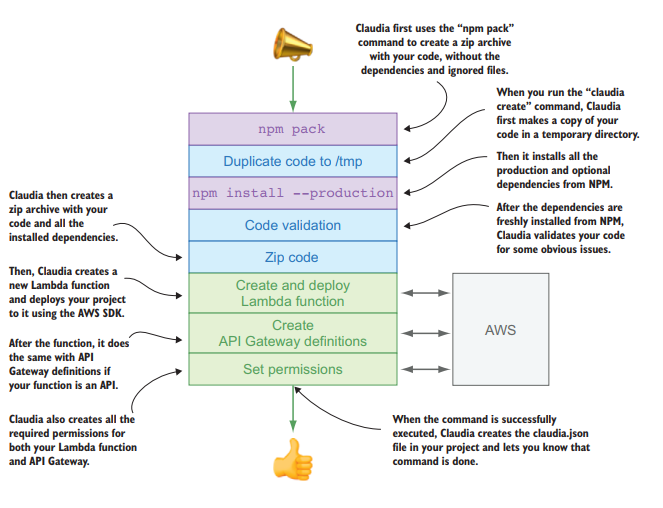
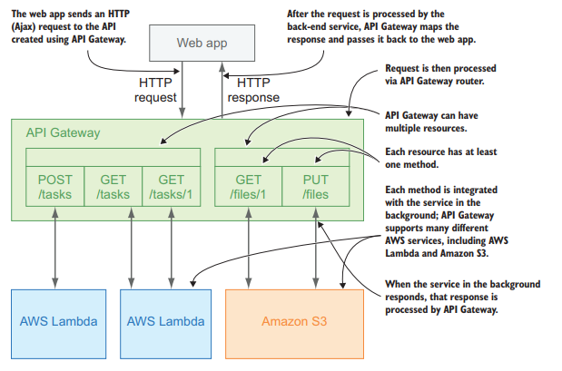

# 第二章 创建第一个无服务API

本章包括

- 用Claudia创建并部署一个API
- Claudia是如何在AWS上面部署API的
- API网关是如何工作的

本章的主要目标是使用Claudia构建你的第一个无服务器API，并将其部署到AWS Lambda和API Gateway上。 你还将看到传统应用程序和无服务器应用程序结构之间的差异，并在了解Claudia在幕后所做的工作的同时能够更好地掌握Claudia。 要从本章中获得最大收益，你应该了解第1章中描述的无服务器的基本概念。

## 2.1 组装披萨原料：构建API

玛丽亚姨妈很高兴和感激你帮助她重新开始她的买卖。 她甚至为你做著名的意大利辣香肠披萨！ （此刻尽量不要饿！）

玛丽亚姨妈已经拥有一个网站，因此你将为她构建一个后端应用程序——更确切地说，是一个API——使她的客户能够预览和订购比萨饼。 API将负责提供比萨饼和订单信息，以及处理比萨饼订单。 之后，玛利亚姨妈还想添加一个移动应用程序，这个移动应用程序可以消费你的API服务。

开头稍微简单一点，第一个API端点将处理一些简单的业务逻辑并返回静态JSON对象。 你可以在图2.1中看到初始应用程序结构的概述。 该图还显示了经过API大致的HTTP请求流。

以下是我们为最初始API提供的功能列表：

- 列出所有的披萨
- 检索披萨订单
- 创建一个披萨订单
- 更新一个披萨订单
- 取消一个披萨订单

这些功能都很小的，而且也简单； 因此，你可以在单个Lambda函数中实现它们。

尽管你可能觉得应该将每个功能分成单独的功能，但现在最简单的方法是将所有功能放在同一个Lambda中，因为这些功能是紧密耦合的。 如果你也要进行库存跟踪，则可以从最开始就将其创建为单独的功能。

每个列出的功能都需要有指向函数中相应处理程序的单独路径。 你可以自己实现路由，但Claudia有一个工具可以帮助你完成该任务：Claudia API Builder。

Claudia API Builder是一个API工具，它可帮助你处理所有传入的API网关请求和响应，以及它们的配置，上下文和参数，并使你能够在Lambda函数中进行内部路由。 它具有类似Express的端点语法，所以如果你熟悉Express的话，Claudia API Builder将非常容易上手。

图2.2显示了如何使用Claudia API Builder在Lambda函数中路由和处理披萨和订单功能的详细描述。该图显示，在收到来自API Gateway的请求后，Claudia API Builder会将重定这些请求到你定义的路由及其相应的处理程序。

> NOTE
>
> 在撰写本文时，你可以用一下两种模式使用AWS API Gateway：
>
> - 使用请求和响应的模型和映射模板
> - 使用代理传递
>
> Claudia API Builder使用代理传递来捕获所有HTTP请求详细信息，并以JS开发人员友好的方式构建它们。
>
> 要了解更多有关代理传递以及模型和映射模板的信息，请阅读 http://docs.aws.amazon.com/apigateway/latest/developerguide/how-to-method-settings.html 上的官方文档。

### 2.1.1 我可以得到哪个披萨？

作为Pizza API的第一个方法，你将创建一个GET披萨服务，它可以列出所有可用的披萨。为此，你需要满足以下先决条件：

- 拥有AWS账户并正确设置AWS凭证文件
- 安装Node.js及其包管理器NPM
- 从NPM安装Claudia作为全局依赖

如果你不熟悉这些步骤或不确定是否已完成这些步骤，请跳至附录A，该附录可以指导你完成每个设置过程。

> 代码示例
>
> 从这里开始，你将看到许多代码示例。我们强烈建议你尝试所有这些示例，即使你对它们很熟悉。你可以使用你喜欢的代码编辑器，除非另有说明。

现在你已完全设置好了，你可以先为第一个无服务器应用程序创建一个空文件夹。你可以根据需要为项目文件夹命名，但在本书中，应用程序文件夹的名称为pizza-api。创建它之后，打开终端，导航到新文件夹，然后初始化Node.js应用程序。初始化应用程序后，从NPM安装claudia-api-builder模块作为程序包依赖项，如附录A中所述。

下一步是创建应用程序的入口点。在pizza-api文件夹中创建一个名为api.js的文件，并使用你喜欢的代码编辑器打开它。

> ES6语法的代码示例
>
> 本书中的所有代码示例都使用ES6 / ES2015语法。 如果你不熟悉ES6功能，例如箭头功能和/或模板字符串，请参阅由Wes Higbee著作的ES6 in Motion，本书由Manning出版，或者John Resig写的“JavaScript忍者的秘密”第二版。

想要创建API路由，你需要一个Claudia API Builder实例，因为它是一个类而不是程序函数。在api.js文件的开头，要把`claudia-api-builder`引（require）进来并实例化。

现在你可以使用Claudia API Builder的内置路由器。要实现`GET /pizzas`路由， 你需要使用Claudia API Builder实例的`get`方法。 `get`方法接收两个参数：一个路由和一个处理函数。作为route参数可传递字符串`/pizzas`，作为处理程序可传递匿名函数。

Claudia API Builder匿名处理函数与Express.js相比有一个很大的区别。在Express.js中，响应和请求会同时作为回调函数参数，但Claudia API Builder的回调函数只有请求。要发回响应，只需返回结果即可。

你的`GET /pizzas`路由应该会显示比萨饼的列表，所以现在，你应该从玛丽亚姨妈的比萨店返回一组静态的比萨饼：Capricciosa，Quattro Formaggi，Napoletana和Margherita。

最后，你需要导出你的API实例，Claudia API Builder适合该实例并将Lambda函数作为中间件。

此时，你的代码应如下所示。

```javascript
'use strict'

const Api = require('claudia-api-builder')
const api = new Api()

api.get('/pizzas', () => {
    return [
        'Capricciosa',
        'Quattro Formaggi',
        'Napoletana',
        'Margherita'
    ]
})

module.exports = api
```

这就是制作一个简单的无服务器函数所需的全部内容。 然而，在打开庆祝香槟酒瓶之前，你应该将代码部署到Lambda函数中。 为此，请跳回你的终端并释放Claudia的力量。

因为Claudia的主要目标之一是单命令部署，所以部署API只需要一个简单的`claudia create`命令即可。 此命令只需要两个选项：你希望部署API的AWS区域和应用程序的入口点。 选项作为标志传递，因此要部署API，只需使用`--region`和`--api-modules`标志执行`claudia create`命令，如清单2.2所示。 第2.2节更详细地解释了`claudia create`命令的复杂性。

> SHELL命令对于WINDOWS用户
>
> 本书中的一些命令分为多行以便于阅读和注释。 如果你是Windows用户，则可能需要将这些命令连接到一行并删除反斜杠（\）

清单2.2 使用Claudia将API部署到AWS Lambda和API Gateway

```shell
claudia create \
--region eu-central-1 \
--api-module api
```

在你所在的地区内，选择距离你最近的用户以最大限度地减少延。离玛利亚姨妈比萨店最近的地区位于德国法兰克福，它被称为`eu-central-1`。 你可以在AWS官方文档中查看所有可用区域：http://docs.aws.amazon.com/general/latest/gr/rande.html#lambda_region。

你的api.js文件是API的入口点。 Claudia会自动附加.js扩展名，所以只需输入api就可作为应用程序的入口点。

> NOTE
>
> 你的入口点的名称和位置由你自己决定；你只需要在`claudia create`命令中提供正确的入口点路径。 例如，如果将其命名为index.js并将其放在src文件夹下，则Claudia命令中的标志应为`--api-module src/index`。

大约一分钟后，Claudia将成功部署你的API。 你会看到类似于清单2.3的响应。 命令响应包含有关Lambda函数和API的有用信息，例如API的基本URL，Lambda函数的名称和区域。

> 部署问题
>
> 如果遇到部署问题（例如凭据错误），请确保按照附录A中的说明正确设置所有内容。

清单2.3 `claudia create `命令响应

```json
{
    "lambda": {
        "role": "pizza-api-executor",
        "name": "pizza-api",
        "region": "eu-central-1"
    },
    "api": {
        "id": "g8fhlgccof",
        "module": "api",
        "url": "https://whpcvzntil.execute-api.eu-central-1.amazonaws.com/latest"
    }
}
```

在部署期间，Claudia在项目的根目录中创建了一个claudia.json文件以及一些相似的信息，但没有你的根API URL。 此文件供Claudia将你的代码与某个Lambda函数和API网关实例相关联。 该文件仅适用于Claudia；不要手动改变它。

现在是时候“品尝”你的API了。 你可以直接从你喜欢的浏览器中试用它。 只需从`claudia create`响应中访问根URL，记住将路由附加到根URL。 它应该类似于https://whpcvzntil.execute-api.eu-central-1.amazonaws.com/latest/pizzas。 当你在浏览器中打开修改后的URL链接时，你应该可以看到以下内容：

```json
["Capricciosa","Quattro Formaggi","Napoletana","Margherita"]
```

> 本书示例中的URL
>
> 本书中的每个示例都不是`最新`的，它们将包含以下格式的不同版本：`chapterX_Y`，其中`X`是章节的编号，`Y`是该章节中的示例编号。 我们这样做是为了你只需复制书中的URL即可运行示例。 当你自己运行代码时，输出URL将包含`最新`版本，而不是你将在本书中看到的`chapterX_Y`。

例如，可以通过以下URL访问第一个示例：https://whpcvzntil.execute-api.eu-central1.amazonaws.com/chapter2_1/pizzas。

恭喜 - 你刚刚用Claudia构建了无服务器API！ 如果这是你第一次，你应该为自己感到自豪，这是暂停的好时机。

### 2.1.2 构建API

在急于添加更多功能之前，你应该总是尝试花几分钟时间重新思考一下你的API结构和组织。将所有路由处理器直接添加到主文件中会使其难以理解和维护，因此理想情况下应将处理程序与路由/布线分开。与一个怪物文件相比，较小的代码文件更易于理解和使用。

考虑到应用程序组织，在撰写本文时，没有任何特定的最佳实践。此外，Claudia还提供完全自由的主题。对于你的Pizza API，因为处理比萨饼和订单的部分不会变得很大，你可以将所有路径处理程序移到一个单独的文件夹中，并且仅保留api.js文件中的路径。之后，因为披萨列表不应该只有披萨名，二手应该具有更多的属性，所以你应该将其移到一个单独的文件中。你甚至可以就像我们之前提到的披萨列表一样更进一步为数据创建一个文件夹。应用这些建议后，你的代码结构应类似于图2.3。

第一个修改是将披萨列表移动到一个单独的文件中，并使用附加信息（例如比萨饼ID和成分）扩展列表。为此，在Pizza API项目的根目录创建一个文件夹，并将其命名为data。然后在新文件夹中创建一个文件，并将其命名为pizzas.json。将以下内容添加到新文件中。

清单2.4 包含披萨信息的JSON

```json
[
    {
        "id": 1,
        "name": "Capricciosa",
        "ingredients": [
            "tomato sauce", "mozzarella", "mushrooms", "ham", "olives"
        ]
    },
    {
        "id": 2,
        "name": "Quattro Formaggi",
        "ingredients": [
            "tomato sauce", "mozzarella", "parmesan cheese", "blue cheese", "goat cheese"
        ]
    },
    {
        "id": 3,
        "name": "Napoletana",
        "ingredients": [
            "tomato sauce", "anchovies", "olives", "capers"
        ]
    },
    {
        "id": 4,
        "name": "Margherita",
        "ingredients": [
            "tomato sauce", "mozzarella"
        ]
    }
]
```

下一步是将`getPizzas`处理程序移动到单独的文件中。 在项目根目录中创建一个名为handlers的文件夹，并在其中创建一个get-pizzas.js文件。

在你的新get-pizzas.js文件中将是`getPizzas`处理程序，它返回清单2.4中的比萨列表。 首先，你需要从你创建的JSON文件中导入比萨列表。 其次，你需要创建一个`getPizzas`处理函数并将其导出，以便你可以从你的条目文件中获取它。 然后，如果将比萨饼ID作为参数传递给你的`getPizzas`处理程序，则不要只返回比萨饼列表，更进一步并返回一个比萨饼。 要返回一个披萨，你可以使用`Array.find`方法，该方法通过披萨列表中的披萨ID搜索披萨。 如果找到披萨，请返回
它作为处理结果。 如果没有任何带有该ID的比萨饼，请让你的应用程序抛出错误。

新披萨处理程序的更新代码应与下一个列表类似。

清单2.5 在单独的文件中使用比萨ID过滤器的`getPizzas`处理程序

```javascript
const pizzas = require('../data/pizzas.json')

function getPizzas(pizzaId) {
    if (!pizzaId)
        return pizzas
    
    const pizza = pizzas.find((pizza) => {
        return pizza.id == pizzaId
    })
    
    if (pizza)
        return pizza
    throw new Error('The pizza you requested was not found')
}

module.exports = getPizzas
```

你还应该从API入口点文件api.js中删除以前的`getPizzas`处理程序代码。 删除导入Claudia API Builder和导出Claudia API Builder实例末尾之间的所有内容。

在导入Claudia API Builder的行之后，从你的处理程序文件夹中导入新的`get-pizzas`处理程序：

`const getPizzas = require('./handlers/get-pizzas')`

> 注意
>
> 你还应该为根路径/的GET路由创建一个处理程序，它应该向用户返回一条静态消息。 虽然是可选的，但我们强烈推荐它。 当有人查询API的URL时，这时候它返回的是一些友好消息而不是错误，那么你的AP就会显得I更加用户友好。

接下来，你应该添加获取比萨饼列表的路由，但这次，你将使用为路线处理创建的`get-pizzas`处理程序。 你应该在api.js文件的开头导入该文件。 如果你还记得，你的`get-pizzas`处理程序也可以按ID过滤比萨饼，所以你应该添加另一条返回单个比萨饼的路由。 编写该路由，这样它可以接收`/pizzas/{id}` url的`GET`请求。` /{id}`部分是动态路由参数，它告诉处理程序用户所请求的披萨ID。 与Express.js一样，Claudia API Builder支持动态路由参数，但它使用不同的语法，这就是为什么它用的是`/{id}`而不是`/:id`。 `request.pathParams`对象中提供了动态路径参数。 最后，如果你的处理程序没有找到你想要的披萨，请返回404错误：

```javascript
api.get('/pizzas/{id}', (request) => {
  	return getPizzas(request.pathParams.id)
  }, {
  	error: 404
})
```

默认情况下，API Gateway为所有请求返回HTTP状态200。 Claudia API Builder通过设置一些合理的默认值（例如状态500的错误）来帮助你，因此你的客户端应用程序可以处理promise catch块中的请求错误。

要自定义错误状态，可以将第三个参数传递给`api.get`函数。 例如，在get`/pizza /{id}`函数处理程序中，除了路径和处理程序函数之外，你还可以传递具有自定义头部和状态的对象。 要将状态错误设置为404，那么久传递一个包含错误404值的对象。

你可以在以下列表中看到完全更新过的api.js文件。

清单2.6 更新的api.js

```javascript
'use strict'

const Api = require('claudia-api-builder')
const api = new Api()

const getPizzas = require('./handlers/get-pizzas')

api.get('/', () => 'Welcome to Pizza API')

api.get('/pizzas', () => {
    return getPizzas()
})
api.get('/pizzas/{id}', (request) => {
    return getPizzas(request.pathParams.id)
}, {
  	error: 404
})

module.exports = api
```

现在再次部署你的API。 想要更新现有的Lambda函数及其API Gateway路由，请从终端运行Claudia update命令：

`claudia update`

> 注意
>
> 根据claudia.json文件，`claudia update`命令可以确切地知道文件要部署到哪个Lambda函数上。 可以使用`—config`标志自定义该命令。 有关更多信息，请参阅https://github.com/claudiajs/claudia/blob/master/docs/update.md上的官方文档。

大约一分钟后，你应该看到类似于清单2.7中的响应。 处理完命令并重新部署应用程序后，Claudia将在终端中打印出有关Lambda函数和API的一些有用信息。 该信息包括API的函数名称，Node.js运行时，超时，函数内存大小和URL。

清单2.7 运行`claudia update`命令后的打印信息

```json
{
    "FunctionName": "pizza-api",
    "Runtime": "nodejs6.10",
    "Timeout": 3,
    "MemorySize": 128,
    "Version": "2",
    "url": "https://whpcvzntil.execute-api.eu-central-1.amazonaws.com/chapter2_2",
    "LastModified": "2017-07-15T14:48:56.540+0000",
    "CodeSha256": "0qhstkwwkQ4aEFSXhxV/zdiiS1JUIbwyKOpBup35l9M=",
    // Additional metadata
}
```

如果你在浏览器中再次打开这个路由链接（看起来与 https://whpcvzntil.execute-api.eu-central-1.amazonaws.com/chapter2_2/pizzas非常像），你将会看到来自data/pizza.js的一组披萨对象。

当你打开另外一个路由链接(看起来像https://whpcvzntil.execute-api.eu-central-1.amazonaws.com/chapter2_2/pizzas/1)，你会只看到第一个披萨。这个响应看起来像这段数据：

`{"id":1,"name":"Capricciosa","ingredients":["tomato sauce","mozzarella","mushrooms","ham","olives"]}`

要测试你的API是否按预期工作，你还应该尝试获取不存在的披萨。 使用不存在的比萨ID访问你的API URL，例如：https://whpcvzntil.execute-api.eu-central-1.amazonaws.com/chapter2_2/pizzas/42。 在这种情况下的响应应该类似于：

`{"errorMessage" : "The pizza you requested wasn't found"}`.

恭喜 - 你的Pizza API现在能够向Maria姨妈的客户展示比萨饼列表啦！ 这将使你的玛丽亚姨妈相当高兴，但你的API还没有完成。 你需要实现API的核心功能：创建披萨订单。

### 2.1.3 创建订单

能够通过你的API创建披萨订单对玛丽亚姨妈来说是非常重要的。 虽然她不像你那样技术熟练，但她知道它会加快比萨饼的订购速度，并帮助她快速为整个社区甚至整个城镇的所有顾客提供服务。

> 注意
>
> 在本例中，你将了解基本的应用程序结构，所以为简化起见，你不会将订单存储在任何地方。 你将在第3章中使用持久存储。

要实现披萨订单创建，你需要有一个“创建披萨订单”的路由和“创建订单”的处理程序，这意味着你需要在Pizza API项目的处理程序文件夹中创建一个新文件。与往常一样，尝试创建简单易读的文件名。在这种情况下，处理程序文件的一个好名称是create-order.js。

首先，创建新的处理程序文件，并在你喜欢的代码编辑器中打开它。接下来，创建`createOrder`函数，并将其导出到文件末尾。你的处理函数需要接受一些订单数据或订单对象。此时，此订单对象应该只有两个属性：客户订购的比萨饼的ID和比萨应该交付的客户地址。

首先，检查订单对象中是否已传递这两个值。如果没有，抛出错误。

以下部分应实现将订单存储到数据库，但此时，如果订单对象有效，你将只返回一个空对象。你可以将对象存储在文件中，但Lambda函数可以部署在多个容器上，并且你无法控制它，因此不依赖于本地状态非常重要。在下一章中，你将学习如何将无服务器功能连接到数据库并实际保存订单。

你的create-order.js文件应该与下一个清单中的文件类似。

清单2.8 创建披萨订单处理器

```javascript
function createOrder(order) {
    if (!order || !order.pizzaId || !order.address)
        throw new Error('To order pizza please provide pizza type and address where pizza should be delivered')
  
    return {}
}

module.exports = createOrder
```

现在你有了创建订单的处理程序，是时候创建一个路由了——但是这个应该接受`POST`请求。 为此，你需要回到api.js文件。 与`api.get`一样，Claudia API Builder有一个`api.post`方法，它接收三个参数：路径，处理函数和选项。

> 注意
>
> 除了GET之外，Claudia API Builder还支持POST，PUT和DELETE作为HTTP动词。

对于路由路径，你应该编写`/orders`，因为你的应用正在创建新订单。 作为路由处理程序函数，导入刚刚在处理程序文件夹中创建的create-order.js文件。 最后，对于options参数，分别为成功和错误传递自定义状态：201和400。 使用`success`属性为成功添加自定义状态。

`POST`请求主体会自动为你解析并在request.body属性中可用，这意味着你不需要使用任何其他中间件来解析收到的数据，例如Express.js的`body_parser`。

> Parsing POST request body
>
> The body of the POST request is automatically parsed by API Gateway. Claudia checks the body and normalizes it. For example, if the content type of the request is application/json, Claudia converts the empty body to an empty JSON object.

After you add the new route, your api.js file should look like the following listing.

Listing 2.9 Main API file updated with the new routes

```javascript
'use strict'

const Api = require('claudia-api-builder')
const api = new Api()

const getPizzas = require('./handlers/get-pizzas')
const createOrder = require('./handlers/create-order')

api.get('/', () => 'Welcome to Pizza API')

api.get('/pizzas', () => {
  return getPizzas()
})

api.get('/pizzas/{id}', (request) => {
  return getPizzas(request.pathParams.id)
}, {
  error: 404
})

api.post('/orders', (request) => {
  return createOrder(request.body)
}, {
  success: 201,
  error: 400
})

module.exports = api
```

再次通过运行`claudia update`命令来部署API。 

尝试POST请求可能比测试GET有点棘手。 您无法通过在浏览器中打开路径URL来测试它。 因此，对于POST路由，您应该使用免费的HTTP测试工具之一，例如`curl`或Postman。

> NOTE
>
> 从现在开始，您将看到测试API端点关于`curl`命令的所有示例。 它们不是强制性的；您可以自由使用您喜欢的任何工具。

> `curl`与Postman
>
> curl是在命令行或脚本中用于传输数据的工具。 它还用于汽车，电视机，路由器，打印机，音频设备，移动电话，平板电脑，机顶盒和媒体播放器，它是的数千种软件应用互联网传输主干，每天影响数十亿人。 `curl`旨在无需用户交干预即可工作。
>
> Postman是一个带有图形用户界面（GUI）的应用程序，它还可以帮助您测试API。 因为您可以通过测试来构建API请求和文档，所以它还可以加快开发速度。 它可用作Mac，Windows和Linux的应用程序以及Chrome插件。

您将使用curl命令测试POST / orders端点。 在此命令中，您将发送一个空的请求正文（body），以便检查验证错误。 除POST正文外，您还需要指定方法，提供头部（header）以告知您的API你正在发送JSON请求，并指定要将请求发送到的完整URL。

> 注意
>
> 默认情况下，curl不会打印响应HTTP状态代码。 要检查API是否返回正确的状态，请使用`-w`标志并在API响应后附加HTTP状态。

你可以在以下列表中看到命令的格式。这个命令带有一个空的主体，所以你可以测试一下错误响应。

代码清单2.10 用于测试POST / orders路由的curl命令（错误响应）

```shell
curl -i \
	-H "Content-Type: application/json" \
	-X POST \
	-d '{}' https://whpcvzntil.execute-api.eu-central-1.amazonaws.com/chapter2_3/orders
```

从终端中运行清单2.10的curl命令后，响应应如下所示，并带有一些额外的标头：

```text
HTTP/1.1 400 Bad Request
Content-Type: application/json
Content-Length: 104
Date: Mon, 25 Sep 2017 06:53:36 GMT
{"errorMessage":"To order pizza please provide pizza type and address where pizza should be delivered"}
```

现在您已经验证了在没有传递订单数据时返回的错误，您还应该测试成功的响应。 为此，请从终端运行类似的`curl`命令; 只要更改一下请求正文，因为它要包含披萨ID和地址。 以下清单显示了更新的`curl`命令。 此命令具有有效正文，因此您可以测试成功的响应。

代码清单2.11 用于测试POST / orders路由的curl命令（成功响应）

```shell
curl -i \
    -H "Content-Type: application/json" \
    -X POST \
    -d '{"pizzaId":1,"address":"221B Baker Street"}' \
    https://whpcvzntil.execute-api.eu-central-1.amazonaws.com/chapter2_3/orders
```

该命令返回以下内容：

```
HTTP/1.1 201 Created
Content-Type: application/json
Content-Length: 2
Date: Mon, 25 Sep 2017 06:53:36 GMT
{}
```

这就可以确定你的API可以正确地工作了。

现在您已经学习了无服务器API基础知识，现在是时候看看Claudia在运行`claudia create`命令时所做的事情了。

## 2.1 Claudia是如何部署API的

前面的例子展示了Claudia的一个主要思想：单命令应用程序部署。这个工具背后没有魔力，所以每个命令都比较容易解释。

图2.4表示运行`claudia create`命令时发生的事件流。为了便于理解，这个简化的图表只侧重于过程中最重要的部分。此外，如果使用`create`命令提供一些标志，则可以跳过或修改此流程中描述的某些事件。例如，如果您提供标志`--use-local-dependencies`，Claudia可以跳过第一步并使用所有本地依赖项复制代码。有关选项的完整列表，请参阅https://github.com/claudiajs/claudia/blob/master/docs/create.md。

当你运行`claudia create`命令时，Claudia所做的第一件事是使用`npm pack`命令压缩你的代码，而不使用依赖项和隐藏文件。然后，它会在您系统的临时文件夹中创建项目的副本。这一行动确保了清洁和可重复的释放，始终从众所周知的角度出发防止潜在的本地依赖性导致的问题。在此步骤中，Claudia会忽略您的node_modules文件夹以及Git或NPM忽略的所有文件。它还使用`npm install --production`命令安装您的生产和可选依赖项。

由于Lambda函数要求将所有依赖项的代码作为zip文件上载，因此在将项目压缩为zip文件之前，Claudia会安装所有生产和可选的NPM依赖项。



图2.4 `claudia create`过程

此外，由于调试Lambda函数并不那么直接，正如您将在第5章中看到的那样，Claudia还会验证您的项目没有任何明显的问题，例如拼写错误或您的应用程序调用未定义的模块。用一粒盐来完成这一步，因为它只会进行浅层验证。如果您在函数或处理程序正文中有拼写错误或未定义的函数或模块调用，则此步骤将无法捕获它。

下一步，Claudia使用您的代码创建一个zip文件，并在第一步中安装所有依赖项。

图2.4中的最后三个步骤不是按顺序执行，而是并行执行。

创建zip文件后，Claudia会调用AWS API来创建Lambda函数并上载存档。与AWS平台的交互是通过适用于Node.js的AWS开发工具包模块完成的。在上传代码之前，Claudia会创建一个新的IAM用户，并为IAM用户分配某些权限，以允许它与AWS Lambda和API Gateway进行交互。

> AWS IAM用户，角色和权限
>
> 通过AWS身份和访问管理（IAM），您可以安全地控制对用户的AWS服务和资源的访问。使用IAM，您可以创建和管理AWS用户和组，以及使用权限来允许或拒绝任何用户或组访问您的AWS资源。
>
> 对IAM的更深入解释超出了本书的范围，但我们强烈建议您在进入下几章之前先阅读更多相关内容。您可以从官方文档开始：https：//aws.amazon.com/iam/。
>

完全设置Lambda函数后，Claudia会为其设置API网关实例，定义所有路由并设置其所需的权限。

`claudia update`命令流几乎与`claudia create`命令相同，但没有一些已经完成的步骤，例如角色创建和权限设置。

如果你想更深入地了解Claudia及其命令，你可以在这里看到它的源代码：https://github.com/claudiajs/claudia。

现在您已经了解了Claudia的工作原理，API难题的最后一部分是了解API Gateway如何为您的Pizza API进行路由。

## 2.3 流量控制：API网关的工作原理
在第1章中，您了解到除非触发器唤醒该功能，否则用户无法在AWS平台之外与AWS Lambda交互。 Lambda最重要的触发器之一是API网关。

如图2.5所示，API Gateway的作用类似于路由器或流量控制器。 它接受HTTP请求（例如来自您的Web或移动应用程序的Pizza API请求），将它们解析为通用格式，并将它们路由到您连接的某个AWS服务。



图2.5 API网关将请求路由到您的AWS服务。

API Gateway可以与许多AWS服务集成，包括AWS Lambda和Amazon S3。 API网关上的每个API都可以连接到多个服务。 例如，某些路由可以调用Lambda函数，而其他路由可以与其他某些服务进行交互。

API Gateway提供了另一种HTTP请求路由方法，称为代*理路由器*。 代理路由器不是创建每个路由，而是将所有请求发送到单个AWS Lambda函数。 当您创建小型API或希望加速部署时，此方法非常有用，因为在API网关上创建和更新多个路由可能需要几分钟，具体取决于您的Internet连接速度和路由数量。

