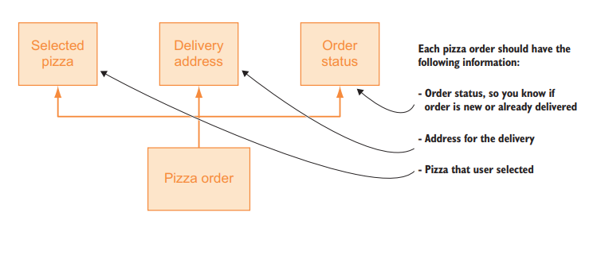
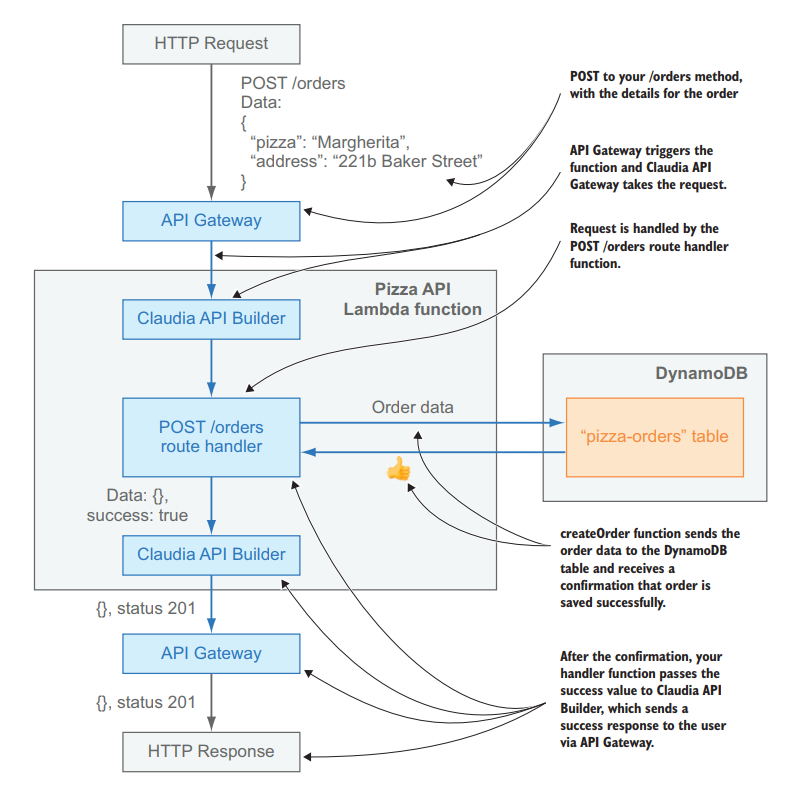

# 第三章 我们Promise()，异步工作是很简单的

本章包括

- 使用Claudia处理异步操作

- JavaScript promises的基础

- 从Claudia和AWS Lambda连接到DynamoDB

在上一章中，你创建了一个用于处理披萨信息和订单的简单API。 你还了解到与传统的Node.js服务器不同，AWS Lambda状态在后续调用中丢失。 因此，需要数据库或外部服务来存储Aunt Maria的披萨订单或你想要保留的任何其他数据。

当Node.js异步执行时，你将首先了解无服务器是如何影响异步通信的：它如何与Claudia一起工作，更重要的是，什么是推荐的开发无服务器应用程序的方法。 当你掌握这些概念时，你将看到将AWS Lambda连接到外部服务是多么容易，你将学习如何使用它来使用AWS DynamoDB存储你的披萨订单。

因为我们的大脑不擅长异步阅读，书籍是以同步方式编写的，所以让我们一步一步走。

## 3.1 订单排序

铃铃铃，铃铃铃！你和玛丽阿姨打了一个电话。她对你的速度印象深刻，但她仍然无法使用你的申请，因为你没有存储她的任何披萨订单。她仍然需要使用旧的纸笔方法。要完成Pizza API的基本版本，你需要将订单存储在某个地方。

在开始开发之前，你应该始终了解要存储的详细信息。在你的情况下，最基本的披萨订单由选定的披萨，送货地址和订单状态定义。为清楚起见，这种信息通常作为图表绘制。所以作为一个小练习，花一点时间尝试自己画。

你的图表应与图3.1类似。

现在你已经了解了要存储的内容，让我们看看你应该如何为数据库构建它。如前所述，你不能依赖AWS Lambda存储状态，这意味着在Lambda文件系统中存储订单信息不在桌面上。

在传统的Node.js应用程序中，你将使用一些流行的数据库，例如MongoDB，MySQL或PostgreSQL。在无服务器的世界中，每个无服务器提供商都具有不同的数据存储系统组合。 AWS没有针对任何这些数据库的开箱即用解决方案。

作为最简单的替代方案，你可以使用Amazon DynamoDB，这是一个流行的NoSQL数据库，可以轻松连接到AWS Lambda。

> 注意
>
> AWS Lambda不仅限于DynamoDB，你可以将其与其他数据库一起使用，但这超出了本书的范围。

> 什么是DynamoDB？
>
> DynamoDB是亚马逊提供的完全托管的专有NoSQL数据库服务，作为其AWS产品组合的一部分。 DynamoDB向Dynamo公开了一个类似的数据模型，并从Dynamo中获取了它的名称，Dynamo是一个具有不同底层实现的高可用键值结构化存储系统。



图3.1 最基本的披萨订单

简而言之，DynamoDB只是无服务器应用程序的数据库构建块。 DynamoDB是NoSQL数据库中AWS Lambda的计算功能：完全托管，自动调整且相对便宜的云数据库解决方案。

DynamoDB将数据存储在其数据表中。 数据表表示数据集合。 每个表包含多个项目。 项表示由一组属性描述的单个概念。 你可以将项目视为JSON对象，因为它具有以下类似特征：

- 键是唯一的。
- 你需要的属性量不会受到限制。
- 值可以是不同的数据类型，包括数字，字符串，对象。

该表只是你之前定义的模型的存储表示，如图3.1所示。

现在，你需要将先前定义的模型转换为数据库理解的结构：数据库表。 在执行此操作时，请记住DynamoDB几乎是无模式的，这意味着你只需要定义主键并稍后可以添加其他所有内容。 作为第一步，你将为你的订单设计最小可用表。

准备好了吗？

与在任何其他数据库中一样，你希望将每个订单存储为数据库表中的一个项目。 对于你的披萨订单存储，你将使用单个DynamoDB表，该表将是你的订单的集合。 你希望通过API接收订单并将其存储到DynamoDB表中。 每个订单都可以通过一系列特征来描述：

- 唯一订单ID
- 披萨选择
- 派送地址
- 订单状态

你可以将这些特征用作表中的键。 你的订单表应该看起来像表3.1。

表3.1 DynamoDB中的订单表的结构

| 订单ID | 订单状态 |    披萨     |       地址        |
| :----: | :------: | :---------: | :---------------: |
|   1    | pending  | Capricciosa | 221B Baker Street |
|   1    | pending  | Napoletana  |  29 Acacia Road   |

下一步是创建你的table，将其命名为`pizza-orders`。与AWS中的大多数情况一样，你可以通过以下几种方式执行此操作我们首选的方法是使用AWS CLI。要为订单创建表，可以使用`aws dynamodb create-table`命令，如清单3.1所示。

创建表时，需要提供一些必需的参数。首先，你需要定义表名；在你这个案例中，将它命名为`pizza-orders `。然后，你需要定义属性。正如我们前面所提到的，DynamoDB只需要主键定义，因此你只能定义`orderId`属性并告诉DynamoDB它将是string类型。你还需要告诉DynamoDB`orderId`将是主键（或者，在DynamoDB的世界中是哈希键）。

之后，你需要定义预配置吞吐量，告知DynamoDB应为应用程序保留哪些读写容量。因为这是应用程序的开发版本，所以将读取和写入容量设置为1将完全正常，你可以稍后通过AWS CLI进行更改。 DynamoDB支持自动缩放，但它需要定义最小和最大容量。此时，你不需要使用自动缩放，但如果你想了解更多信息，请访问http://docs.aws.amazon.com/amazondynamodb/latest/developerguide/AutoScaling.html。

最后，你需要选择要创建表的区域。选择与Lambda函数相同的区域，以减少数据库通信的延迟。以下清单显示了完整命令。

代码清单3.1 用AWS CLI创建一个DynamicDB表

```shell
aws dynamodb create-table --table-name pizza-orders \
    --attribute-definitions AttributeName=orderId,AttributeType=S \
    --key-schema AttributeName=orderId,KeyType=HASH \
    --provisioned-throughput ReadCapacityUnits=1,WriteCapacityUnits=1 \
    --region eu-central-1 \
    --query TableDescription.TableArn --output text
```

> 小建议 在AWS CLI命令中添加`--query`属性将过滤输出并仅返回所需的值。 例如， `-  query TableDescription .TableArn`仅返回表的ARN。
>
> 你还可以使用`--output`属性以及值来定义输出的类型。 例如，` -  output text`将结果作为纯文本返回。

当你在清单3.1中运行该命令时，它会打印你的DynamoDB表的ARN，并且看起来类似于：

`arn:aws:dynamodb:eu-central-1:123456789101:table/pizza-orders`

就是它！ 现在你有了`pizza-order`的DynamoDB表。 让我们看看如何将它连接到API的路由处理程序。

为了能够从Node.js连接到DynamoDB表，你需要安装适用于Node.js的AWS开发工具包。你可以像使用任何其他模块一样从NPM获取`aws-sdk`。如果你不熟悉该过程，请参阅附录A.

你现在拥有了所有的成分，现在是时候迈出最重要的一步了：结合所有的碎片，就像准备披萨一样。 （幸运的是，我们在上一个附录中有披萨配方。）

从Node.js应用程序与DynamoDB进行通信的最简单方法是通过`DocumentClient`类，这需要异步通信。与AWS SDK的任何部分一样，`DocumentClient`与Claudia完美配合，你将在第2章中使用的API路由处理程序中使用它。

> DynamoDB DocumentClient
>
> `DocumentClient`是AWS SDK的DynamoDB子集的一个类。其目标是通过抽象操作来简化表项的处理。它开放了一个简单的API，我们将仅涵盖本章稍后你需要的部分。如果你想查看API文档，请访问：http：//docs.aws.amazon.com/AWSJavaScriptSDK/latest/AWS/DynamoDB/DocumentClient.html。

将你的披萨订单API连接到新创建的数据库很容易。 将订单存储到DynamoDB表只需两个步骤：

1. 导入AWS DSK，并初始化DynamoDB `DocumentClient`。
2. 更新POST方法来保存订单


因为你在第2章中将代码拆分为单独的文件，所以让我们从处理程序文件夹中的create-order.js文件开始。 以下清单显示了如何更新create-order.js以将新订单保存到pizza-orders DynamoDB表中。

代码清单3.2 保存订单到DynamoDB表中

```javascript
const AWS = require('aws-sdk')
const docClient = new AWS.DynamoDB.DocumentClient()

function createOrder(request) {
    if (!request || !request.pizza || !request.address)
    	throw new Error('To order pizza please provide pizza type and address where pizza should be delivered')
    return docClient.put({
        TableName: 'pizza-orders',
        Item: {
            orderId: 'some-id',
            pizza: request.pizza,
            address: request.address,
            orderStatus: 'pending'
        }
    }).promise()
    .then((res) => {
        console.log('Order is saved!', res)
        return res
    })
    .catch((saveError) => {
        console.log(`Oops, order is not saved :(`, saveError)
        throw saveError
    })
}

module.exports = createOrder
```

完成此步骤后，Pizza API的`POST /orders`方法应该按照图3.2中的方式显示和工作。

我们解释一下这里发生了什么。 导入AWS开发工具包后，你需要初始化DynamoDB `DocumentClient`。 然后，你可以使用先前导入的`DocumentClient`将create-order.js处理程序第7行返回的空对象替换为使用表保存订单的代码。



图3.2 使用DynamoDB集成的Pizza API的`POST /orders`方法流程

要将订单保存到DynamoDB，可以使用`DocumentClient.put`方法将新项目放入数据库中，要么创建新项目或替换具有相同ID的现有项目。` put`方法需要一个可以描述表的对象，方法是通过提供以下`Item`属性作为对象来提供`TableName`属性和项。在你的数据库表计划中，你确定你的项目应具有四个属性 -  ID，披萨，地址和订单状态 - 这正是你要添加到要传递给`DocumentClient.put`方法的Item对象的内容。

由于Claudia API Builder期望承诺执行异步操作，因此你应该使用`DocumentClient.put`的`.promise`方法。 `.promise`方法将回复转换为JavaScript promise。有些人可能想知道Promise如何在无服务器应用程序中工作以及Claudia如何处理异步通信方面存在任何差异。以下部分简要说明了承诺以及它们如何与Claudia和Claudia API Builder一起使用。如果你已熟悉这些概念，请跳至第3.3节

##  3.2 承诺在30分钟内发货

披萨店的工艺包括面团上升，烘焙，披萨饼订购等。 这些是异步操作。 如果他们是同步的，玛丽亚姨妈的披萨店会
被阻塞并停止处理其他任何事情，直到正在进行的操作完了。 例如，你要等到面团发酵，然后再做别的。 对于这样浪费时间的做法，玛丽姨妈会解雇任何人，即使是你！因为大多数JavaScript运行时都是单线程的，所以运行时间更长，
例如网络请求，是异步执行的。 异步代码的执行由两个已知的概念处理：回调和Promise。 在撰写本文时，promises是所有Node.js应用程序的推荐方式。 我们不解释回调，因为你很可能已经熟悉它们了。

> 异步的promise
>
> promise表示异步操作的最终结果。

Promise就像是对合作伙伴，朋友，父母和孩子的现实承诺一样：

- “亲爱的，请你带走垃圾吗？”
- “是的，亲爱的，我保证！”

过了几个小时之后，猜猜谁拿走了垃圾？

Promise对于回调来说却是好东西。 在实际情况中，你可以围绕特定操作或操作包装promise。 promise可以有两种可能的结果：*resolved*（完成）或*rejected*（未完成）。

Promise可以有与之相关的条件，这就是它们的异步功能发挥作用的地方：

- “约翰尼，当你完成作业时，你将能够出去玩！”


此示例显示仅在完成某个异步操作后某些操作才会发生。 以相同的方式，某些代码块的执行需要等待已定义的promise的完成。

以下列表是示例句子表示的就是JavaScript promise。

清单3.3 Johnny的游戏 - promise方式

```javascript
function tellJohhny(homework) {
  return finish(homework)
    .then(finishedHomework => {
      return getOut(finishedHomework);
    })
    .then(result => {
      return play();
    })
    .catch(error => {
      console.log(error);
    });
}
```

promise有几个特点：

- *promise链* - 如清单3.3所示，你可以轻松地将一个promise链接到另一个promise，将结果从一个代码块传递到下一个代码块而不会有任何麻烦。
- *并行执行* - 你可以同时执行两个函数，并且一次获得两个结果。
- *正确的异步操作拒绝* - 如果函数出错或者没有给出合适的结果，你可以随时拒绝它并停止执行。相比之下，通过回调，拒绝promise会阻止整个promise链。
- *错误恢复* -  promise catch块允许你轻松，正确地管理错误并将其传播到负责的错误处理程序。

有些客户在一个订单中订购了多个披萨饼，但这些披萨饼并非一个一个地送出去。如果是这样，客户会对如此低效的流程感到不爽。相反，披萨厨师通常会同时烘烤它们；然后送货人在发货前要等到所有这些披萨都弄完。

以下列表是此过程的代码表示。

清单3.4披萨平行烘焙

```javascript
function preparePizza(pizzaName) {
  return new Promise((resolve, reject) => {
    // prepare pizza
    resolve(bakedPizza);
  });
}

function processOrder(pizzas) {
  return Promise.all([
    preparePizza('extra-cheese'),
    preparePizza('anchovies')
  ]);
}

return processOrder(pizzas)
  .then((readyPizzas) => {
    console.log(readyPizzas[0]); // prints out the result from the extracheese pizza
    console.log(readyPizzas[1]); // prints out the result from the anchovies
    pizza
    return readyPizzas;
  })
```

正如你在清单3.3和3.4中所看到的，promise有很多好处。 它们允许你处理玛丽亚姨妈的披萨店可能出现的任何情况，并帮助你正确描述所有过程。 Claudia完全支持所有promise功能，因此你可以轻松使用它们。

在下一个清单中，你可以看到一个处理程序在一秒钟后回复的简单Claudia示例。 因为`setTimeout`没有返回promise，所以需要使用`new Promise`语句来包装它。

清单3.5 打包不支持带promise的promise的异步操作

```javascript
const Api = require('claudia-api-builder')
const api = new Api()

api.get('/', request => {
  return new Promise(resolve => {
    setTimeout(() => {
      resolve('Hello after 1 second')
    }, 1000)
  })
})

module.exports = api
```

正如你在清单3.5中看到的，与一些流行的Node.js框架相反，Claudia API Builder仅在路由处理程序中公开请求。 在第2章中，要想回复它，你将返回一个值，但在异步操作的情况下，你应该返回一个JavaScript promise。 Claudia API Builder收到它，等待它被解析，并且使用返回的值作为回复。

> 注意 AWS SDK支持对JavaScript promise的开箱即用。 所有SDK类都有一个promise方法，它可以返回一个promise，而不是默认的回调行为。